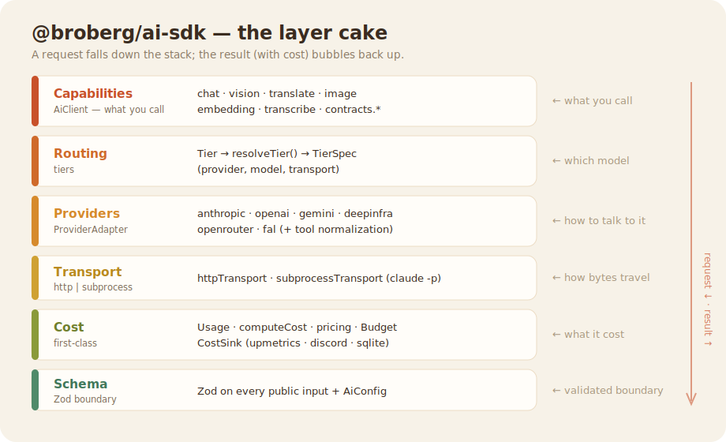

# @broberg/ai-sdk — API & Architecture

> The public guide to what the SDK is, how to bundle it into an app, and the
> abstractions it's built from. Companion to the short [README](../README.md).

---

## 1. Why this exists

Across the portfolio (cms, trail, buddy, sanneandersen, xrt81, …) every repo had
re-invented its own LLM plumbing: a different provider SDK, a hand-rolled
fallback chain, ad-hoc cost tracking (or none). An earlier attempt to wrap the
Vercel AI SDK failed because repos kept speaking the *underlying* SDK's dialect —
the wrapper leaked.

`@broberg/ai-sdk` is a **facade with its own contract**. The design principles:

1. **Provider-agnostic surface.** Your code calls `ai.vision()`, `ai.chat()` —
   never `new Anthropic()` or `fetch("api.openai.com/…")`. Swap providers by
   changing a *tier*, not your call-sites.
2. **Cost is first-class.** Every call returns a `Usage` (tokens, **cost in USD**,
   latency, transport) and can fan that out to any sink. Cost is never an
   afterthought you bolt on later.
3. **One SDK, all repos.** The same facade everywhere means one place to add a
   provider, fix pricing, or change the cost pipeline — it trickles down.
4. **Lean + typed.** Bun + TypeScript, ESM-only, Zod on every public boundary,
   plain `fetch` adapters (no heavyweight provider SDKs bundled).

Proven in production: a real xrt81 image-upload runs
`ai.vision()` → `upmetricsSink` → upmetrics `agent_runs` with metered cost.

---

## 2. Install & bundle into an app

```bash
bun add @broberg/ai-sdk     # or: npm i @broberg/ai-sdk / pnpm add
```

- **ESM-only.** Your app must be `"type": "module"` (or import dynamically).
- **Runs on Node and Bun.** `bun:sqlite` (used only by `sqliteSink` /
  `sqliteBudgetStore`) is loaded lazily, so importing the package never breaks a
  Node consumer.
- **No keys in code.** Each adapter reads its key from the environment at call
  time. Set what you use:

  | Env var | Used by |
  |---|---|
  | `ANTHROPIC_API_KEY` | Anthropic (http). Subprocess uses the local `claude` CLI, no key |
  | `OPENAI_API_KEY` | OpenAI chat/vision/embedding + Whisper |
  | `GOOGLE_API_KEY` (or `GEMINI_API_KEY`) | Google Gemini |
  | `DEEPINFRA_API_KEY` | DeepInfra |
  | `OPENROUTER_API_KEY` | OpenRouter (incl. MiniMax) |
  | `FAL_KEY` | fal.ai images |

### The one-time wiring in your app

Create the client **once** (e.g. a module singleton) and reuse it:

```ts
// lib/ai.ts
import { createAI, upmetricsSink } from "@broberg/ai-sdk";

export const ai = createAI({
  // Optional: report every call's cost somewhere.
  costSink: upmetricsSink({
    baseUrl: process.env.UPMETRICS_BASE_URL ?? "https://upmetrics.org",
    apiKey: process.env.UPMETRICS_API_KEY!, // your project's X-Upmetrics-Key
    agentName: "my-app",                    // how dashboards group runs
  }),
  // Optional: pre-flight spend guard.
  budget: { perCallUsd: 0.05, rollingUsd: 5 },
});
```

Then everywhere else: `import { ai } from "./lib/ai"` and call capabilities.

### Migrating an existing call-site

Replace a direct provider call with the matching capability. Example — xrt81's
vision call went from a hand-rolled `fetch("api.anthropic.com/v1/messages")` to:

```ts
const { text, usage } = await ai.vision({ image: bytes, mimeType: "image/jpeg", prompt });
// text → your existing JSON-parsing; usage → already reported to the sink
```

> **Built-in failover:** pass `fallback: [<tier|spec>, …]` and the SDK tries the
> primary route, then each fallback in order if a call errors — so you no longer
> need to hand-roll a try/catch chain (§4).

---

## 3. The abstractions (the layer cake)



### 3.1 Facade — `createAI()` → `AiClient`
The single entry point. `createAI(config?)` returns an `AiClient` with the
capability methods. It owns *orchestration*: resolve the tier, pick the provider,
run a pre-flight budget check, time the call, stamp call-context onto `Usage`,
and report to the sink. Adapters never see budgets or sinks — that's the
facade's job.

### 3.2 Routing — Tiers
A **Tier** is a named intent, not a model. The six built-ins:

| Tier | Default route | Use for |
|---|---|---|
| `fast` | anthropic haiku (http) | quick, cheap text |
| `smart` | anthropic sonnet (http) | the default for `chat` |
| `powerful` | anthropic opus (http) | hardest reasoning |
| `cheap` | anthropic haiku (**subprocess** `claude -p`) | Max-plan, **costUsd 0** |
| `vision` | anthropic sonnet (http) | image understanding |
| `embedding` | openai text-embedding-3-small (http) | vectors |

`resolveTier(tier, override?, configMap?)` merges **per-call override > client
config > built-in defaults**. So you can rename what `smart` means globally
(`createAI({ defaults: { smart: { provider:"openrouter", model:"…", transport:"http" } } })`)
or override one call (`ai.chat({ prompt, override:{ provider:"openrouter", model:"minimax/minimax-m2.7", transport:"http" } })`).
`DEFAULT_TIER_MAP` is exported if you want to read the defaults.

### 3.3 Providers — `ProviderAdapter`
A thin contract every provider implements (`chat?`, `vision?`, `image?`,
`embedding?`, `transcribe?` — all optional; an adapter implements only what it
supports). The **registry** maps a provider name → adapter. `createAI()` uses
`defaultProviders` (the real adapters, keys from env); pass `providers` to
override, or use the exported `stubProviders` for deterministic tests. Tool /
function-calling is normalized across providers via `toProviderTools` /
`fromProviderToolCall`. Built-in adapters: `anthropicAdapter` (http +
`claude -p`), `openaiAdapter`, `geminiAdapter`, `deepinfraAdapter`,
`openrouterAdapter`, `falAdapter`.

### 3.4 Transport — http vs subprocess
The transport decides *how bytes travel*, never *what they contain*.
`httpTransport` is a provider-agnostic `fetch` wrapper; `subprocessTransport`
spawns the local `claude -p` CLI (Max plan, `costUsd 0`, flagged
`subprocess: true`). A `TierSpec`'s `transport` field selects it.

### 3.5 Cost engine
- **`Usage`** — returned on every call: `{ provider, model, tier?, transport,
  inputTokens, outputTokens, cacheReadTokens, cacheCreationTokens, costUsd,
  latencyMs, capability, purpose?, ts, subprocess? }`. Its fields mirror the
  upmetrics `agent_runs` schema 1:1.
- **`computeCost` + pricing** — versioned per-`(provider, model)` table
  (`getPrice`). Unknown model → 0 (the call still completes).
- **`BudgetGuard`** — pre-flight estimate; throws `BudgetExceededError`
  (`{ kind, limit, spent, requested }`) *before* the request fires. Backed by a
  pluggable `BudgetStore` (default in-memory; `sqliteBudgetStore` for persistent).
- **`CostSink`** — `record(usage)`. A failing sink never crashes a call.
  Built-ins: **`upmetricsSink`** (canonical — forwards to upmetrics
  `/api/agent`), `discordSink`, `sqliteSink` (+ `getCostSummary`), `multiSink`
  (fan-out, error-isolated), `noopSink`.

### 3.6 Schema boundary
Zod schemas are the single source of truth for the public input shapes — the
TypeScript types are `z.infer`-derived, and every client method `.parse()`s its
input, throwing `ZodError` on a bad shape before any provider work happens.

---

## 4. Capabilities reference

| Method | Input (key fields) | Returns | Default tier |
|---|---|---|---|
| `ai.chat` | `{ prompt? \| messages?, system?, tools?, maxTokens?, temperature?, responseFormat? }` | `{ text, toolCalls?, usage }` | `smart` |
| `ai.chatStream` | same input as `ai.chat` | `AsyncIterable<ChatStreamEvent>` | `smart` |
| `ai.vision` | `{ image: string\|Uint8Array, prompt, mimeType?, system? }` | `{ text, usage }` | `vision` |
| `ai.video` | `{ video: string\|Uint8Array, prompt, mimeType?, system? }` | `{ text, usage }` | `video` (gemini-2.5-flash-lite) |
| `ai.translate` | `{ text, to, from? }` | `{ text, usage }` | `fast` |
| `ai.image` | `{ prompt, width?, height?, loras?, lora?, finetune?, finetuneStrength?, retryOnBlack? }` | `{ url, usage }` | fal.ai (flux/schnell; flux-lora when loras given); **BFL EU** when `finetune` given |
| `ai.trainStyle` | `{ images: string\|string[], isStyle?, triggerWord?, steps? }` | `{ loraUrl, configUrl, usage }` | fal flux-lora-fast-training (~$2) |
| `ai.embedding` | `{ text: string \| string[] }` | `{ vectors, usage }` | `embedding` |
| `ai.transcribe` | `{ audio: string\|Uint8Array, language?, durationSec? }` | `{ text, usage }` | openai whisper-1 |
| `ai.ocr` | `{ document: string\|Uint8Array, mimeType? }` | `{ pages: {index,markdown}[], usage }` | mistral-ocr (per-page) |
| `ai.moderate` | `{ input: string \| string[] }` | `{ results: {flagged,categories,categoryScores}[], usage }` | mistral-moderation (per-token) |
| `ai.podcast` | `{ script: {speaker,text}[], voices: {speaker→voiceId} }` | `{ audio, mimeType, usage }` | elevenlabs eleven_v3 (per-char) |
| `ai.tts` | `{ text, voice }` | `{ audio, mimeType, usage }` | elevenlabs eleven_multilingual_v2 (per-char) |

All accept `CallOptions`: `{ tier?, override?, fallback?, purpose?, labels? }`.

**Attribution labels** — `labels?: Record<string,string>` rides each call into the
cost sink for per-tenant/per-customer cost breakdown (one upmetrics project, many
tenants). The `upmetricsSink` merges them into the agent-run `tags` (SDK-owned keys
`capability`/`transport`/`sdk` always win), so a multi-tenant engine attributes spend
without one account per tenant:

```ts
await ai.chat({ prompt, labels: { tenantId: "sanne", kbId: "kb_42" } });
// → agent_runs.tags = { capability, transport, sdk, tenantId, kbId }
```

**Failover** — `fallback` is an ordered list of routes (a `Tier` or a full
`{provider, model, transport}`) tried if the primary call errors:

```ts
await ai.vision({
  image, prompt,
  override: { provider: "anthropic", model: "claude-sonnet-4-6", transport: "http" },
  fallback: [{ provider: "openrouter", model: "anthropic/claude-sonnet-4-6", transport: "http" }],
});
```

### Video Vision — `ai.video` (F019)

Analyze a video natively (e.g. "what's in the first 30 seconds?"). Same shape as
`ai.vision` but with a `video` payload (URL, data-URL, or raw bytes). Default tier
`video` → `gemini-2.5-flash-lite`.

```ts
const { text, usage } = await ai.video({
  video: bytes,                 // Uint8Array | URL | data-URL
  mimeType: "video/mp4",
  prompt: "Describe what happens in this video.",
  // gemma-4 is a cheap, reliable option via OpenRouter:
  override: { provider: "openrouter", model: "google/gemma-4-26b-a4b-it", transport: "http" },
});
```

Live-verified on a real ~15s clip: `gemini-2.5-flash-lite` (~$0.0005), `gemma-4`
(~$0.0003), `nvidia/nemotron-nano-12b-v2-vl:free` ($0). Gemini sends the clip inline
as base64 — **clips over ~20MB need the Gemini Files API** (not yet handled); compress
or route via an OpenRouter video model. `ai.video` reuses the provider `vision` path,
so any video-capable provider works via `override`.

A **budget breach is not a fallback trigger** — it throws immediately (you asked
not to spend, so the SDK won't quietly retry on a pricier route).

### Style LoRA training — `ai.trainStyle` + `ai.image` loras (F021)

Train a reusable **brand/style LoRA** from a set of images, then generate new images
that hit that style every time (instead of prompt-steered output that varies run-to-run).
Backed by fal `fal-ai/flux-lora-fast-training` (train) + `fal-ai/flux-lora` (inference).

```ts
// 1) Train once. Pass image URLs (SDK zips them in-memory) OR a hosted archive URL.
const { loraUrl, usage } = await ai.trainStyle({
  images: ["https://.../a.png", "https://.../b.png", /* ... */],  // or "https://.../styleset.zip"
  isStyle: true,            // default — style LoRA (no captioning/masks)
  triggerWord: "SANNESTYLE",
  steps: 1000,
});
// usage.costUsd ≈ $2 (flat). Takes a few minutes (fal queue). Keep loraUrl.

// 2) Generate in that style — forever.
const { url } = await ai.image({ prompt: "a treatment illustration of a back massage", lora: loraUrl });
//   shorthand `lora` == `loras: [{ path: loraUrl, scale: 1 }]`; use `loras` for multiple / custom scale.
```

- **Reusable** — any repo with a set of brand images gets a consistent house style.
- **Zip gotcha handled** — fal needs the training images as an archive on a fetchable URL;
  `images: string[]` is fetched + zipped in-memory (node:zlib, no deps) and sent as a `data:` URI.
  For very large sets, pre-host a zip and pass its URL as `images` (passthrough).
- **Key** — fal reads `FAL_KEY` (or `FAL_API_KEY`).
- **Black-image guard** — `ai.image({ …, retryOnBlack: true })` re-rolls once with a fresh
  seed if fal's NSFW safety-checker false-positives and blanks the image
  (`has_nsfw_concepts`). The re-roll is a second billed generation.

### Person / portrait generation — `ai.image({ finetune })`, EU-resident (F023)

GDPR-safe, **EU-resident** photorealistic portraits from a person's trained
likeness, via **Black Forest Labs** pinned to `api.eu.bfl.ai`. A face is biometric
personal data, so the adapter **hard-pins the EU endpoint** (never the global
`api.bfl.ai`, which can failover to the US) and polls the EU `get_result` directly.

> **Governance — consent only.** Generate a person's likeness ONLY with their explicit
> consent (a customer who *wants* their own portrait). Never a deepfake of anyone
> without sign-off. "Do good, do no evil."

**Delt flow** (BFL retired finetune-create from its public API — verified): train the
subject **once, manually**, in `dashboard.bfl.ai` (1–20 photos, `mode = character`,
pick the EU region), copy the `finetune_id`; the SDK then generates EU-resident:

```ts
const { url, usage } = await ai.image({
  prompt: "<trigger_word> as a professional studio headshot",
  finetune: "<finetune_id>",   // ← routes to the BFL EU adapter automatically
  finetuneStrength: 1.2,        // ~0–2; higher = stronger likeness
});
// usage.costUsd ≈ $0.06/image (flux-pro-1.1-ultra-finetuned estimate; override via adapter config).
```

- **Key** — `BFL_API_KEY` (gitignored `.env`). Ship-dark: inert until set.
- **Sizing** — `width`/`height` derive a gcd-reduced `aspect_ratio` (ultra takes a ratio, not px).
- **Training is NOT API-automated** — the public BFL API has no finetune-create endpoint;
  it's the one-time dashboard step above. `ai.trainStyle` (fal) is unrelated — that's *style*, US.

### Podcast & speech — `ai.podcast` / `ai.tts` (F020)

`ai.podcast` turns a finished multi-speaker manuscript into **one** cohesive
multi-voice MP3 in a single ElevenLabs Text-to-Dialogue call (`eleven_v3`) —
auto speaker-transitions, emotion, inline audio tags (`[laughs]`, `[whispers]`).
Your app owns the script; the SDK does the transcript→audio half. Danish-capable.

```ts
const { audio, mimeType, usage } = await ai.podcast({
  script: [
    { speaker: "host",  text: "Velkommen til podcasten! [laughs]" },
    { speaker: "guest", text: "Tak — dejligt at være her." },
  ],
  voices: { host: "noam", guest: "camilla" },   // friendly names OR raw voiceIds
});
// audio: Uint8Array (audio/mpeg), usage.costUsd per-character non-zero
```

`ai.tts` is the single-voice cousin (ElevenLabs `eleven_multilingual_v2`) — better
Danish than Voxtral:

```ts
const { audio } = await ai.tts({ text: "Hej, det her er en test.", voice: "soren" });
```

**Named Danish voices** (`ELEVENLABS_DANISH_VOICES`, also exported) resolve friendly
names → voiceIds, so apps never hardcode raw IDs: `soren`, `jesper`, `mads`, `noam`,
`camilla`. Pass a name anywhere a `voice` / `voices` value is expected, or a raw
ElevenLabs voiceId to use any other voice. **Library (named) voices require a paid
ElevenLabs plan** — the free tier 402s on them; the 25 default voices speak Danish too.

### Streaming — `ai.chatStream`

For streaming chat UIs (live token deltas + agentic tool-loops), `ai.chatStream`
takes the **same input** as `ai.chat` and returns an `AsyncIterable<ChatStreamEvent>`:

```ts
for await (const ev of ai.chatStream({ messages, tools, fallback: […] })) {
  switch (ev.type) {
    case "text":      process.stdout.write(ev.delta); break;       // live deltas
    case "tool_call": run(ev.name, ev.args); break;                // id, name, args — emitted COMPLETE
    case "usage":     log(ev.costUsd, ev.model); break;            // ev.usage is the full Usage
    case "finish":    break;                                        // "end_turn" | "tool_calls" | "length" | "stop"
    case "error":     warn(ev.message, ev.status); break;
  }
}
```

- **Per-turn engine, not an agent runtime.** You own the tool-loop: when a turn
  finishes with `tool_calls`, execute them, append the `assistant`(with `toolCalls`)
  + `tool`(result, `toolCallId`) messages, and call `chatStream` again.
- **All chat providers stream.** OpenAI/DeepInfra/OpenRouter (OpenAI-compatible),
  Anthropic-direct (`/v1/messages` SSE), and Gemini-direct (`streamGenerateContent`).
- **Pre-stream fallback.** The `fallback` chain re-routes on an eligible error
  (429/5xx/network) **before the first token**; once deltas have started, an error
  surfaces as an `{type:"error"}` event (deltas can't be un-emitted).
- **`usage` is reported to the cost sink** like any other call (it carries the
  full `Usage`, cost included).

### JSON mode — `responseFormat`

`ai.chat`/`ai.chatStream` accept `responseFormat: "json"` to request a JSON object
from OpenAI-compatible providers (OpenRouter/OpenAI/DeepInfra) — no more
markdown-fence stripping at the call-site:

```ts
const { text } = await ai.chat({ prompt: "…return JSON…", responseFormat: "json" });
const data = JSON.parse(text);
```

### Prompt contracts — `ai.contracts.*`
Structured calls layered on chat/vision (so budget + cost apply uniformly):

| Contract | Purpose |
|---|---|
| `mockup({ description, constraints? })` | description → HTML/Tailwind mockup |
| `design({ screenshot, instructions })` | vision-based design iteration → HTML |
| `extract({ text, schema })` | text → JSON validated against a **Zod schema** (retries once) |
| `classify({ text, labels })` | zero-shot → `{ label, confidence }` |
| `rerank({ query, items })` | relevance → `{ ranked: [{item, score}] }` |

```ts
import { z } from "zod";
const { data } = await ai.contracts.extract({
  text: "Sanne is 40 in Blokhus",
  schema: z.object({ name: z.string(), age: z.number(), city: z.string() }),
});
```

---

## 5. Cost & budget in practice

```ts
import { createAI, multiSink, upmetricsSink, sqliteSink, BudgetExceededError } from "@broberg/ai-sdk";

const ai = createAI({
  budget: { perCallUsd: 0.05, rollingUsd: 5 },
  costSink: multiSink([
    upmetricsSink({ baseUrl: "https://upmetrics.org", apiKey: KEY, agentName: "my-app" }),
    sqliteSink({ dbPath: "./ai-cost.db" }),
  ]),
});

try {
  const { text, usage } = await ai.chat({ prompt: "…", purpose: "summarize-ticket" });
  console.log(usage.costUsd, usage.inputTokens, usage.outputTokens);
} catch (e) {
  if (e instanceof BudgetExceededError) console.warn(`over budget: ${e.requested} > ${e.limit}`);
}
```

`purpose` is a free-text label that rides into the sink (`agent_runs.purpose`)
for per-feature cost attribution.

---

## 6. Cost precision & budget persistence

- **Token-based calls are metered exactly** from the pricing table.
- **OpenRouter cost is ground-truth.** The openrouter adapter sends
  `usage:{include:true}` and uses OpenRouter's returned `usage.cost` (USD) as
  `costUsd`, falling back to the pricing table only if absent — so openrouter
  routes (primary *or* fallback) never log `$0` for an unpriced model.
- **fal.ai images** use a per-image USD **estimate** per model
  (`config.pricePerImage` overrides) since fal returns no price.
- **Gemini images** — `ai.image({ override:{ provider:"gemini", model:"gemini-3-pro-image-preview", transport:"http" } })`
  returns the inline image as a `data:<mime>;base64,…` URL (Gemini sends bytes, not
  a hosted URL); priced per image ($0.039 for nano-banana models, `pricePerImage` overrides).
- **Whisper** is per-minute: pass `durationSec` to `ai.transcribe` and it prices
  `(durationSec/60) × $0.006`. Omit it → `costUsd 0` (the API returns no duration).
- **Persistent / shared budget.** By default `BudgetGuard`'s rolling total is
  in-memory (per `createAI` instance). For a budget that survives restarts and is
  shared across processes/instances, pass a persistent store:

  ```ts
  import { createAI, sqliteBudgetStore } from "@broberg/ai-sdk";
  const ai = createAI({
    budget: { rollingUsd: 20, store: sqliteBudgetStore({ dbPath: "./ai-budget.db", key: "2026-06-02" }) },
  });
  ```

  `sqliteBudgetStore` needs Bun (like `sqliteSink`). On Node, implement the
  `BudgetStore` interface (`getSpent` / `addSpent`) yourself to back it with
  redis, Postgres, or any shared store.

*(Resolved across v0.1.2 → v0.2.0: `CallOptions.fallback` executes a real failover
chain (§4); fal per-image cost; Whisper per-minute cost; pluggable persistent
budget store. v0.3.0: `ai.chatStream` streaming (all chat providers) + tool-loop
threading (F008); `responseFormat:"json"` (F009); OpenRouter ground-truth cost (F010).
v0.3.1: anthropic tool_use/tool_result threading. v0.4.0: per-call attribution
`labels` for multi-tenant cost (F011). v0.4.1: dated model-id pricing (F012).
v0.5.0: Gemini image generation (F013). v0.5.1: gemini-direct $0-cost fix (F012-class).
v0.6.0: `ai.video` native video vision (F019) + official Mistral provider + prices (F015).
v0.7.0: `ai.ocr` (per-page) + `ai.moderate` (per-token) via Mistral (F016.2 + F016.4).
v0.8.0: `ai.podcast` (multi-voice episode) + `ai.tts` (single voice) via ElevenLabs, named Danish voices (F020).
v0.9.0: Mistral embeddings + Voxtral transcribe + `ai.batch.*` (50% async); monthly model-research GHA + inventory enrichment (F016/F014/F017).
v0.9.1: DeepSeek V4 pricing via OpenRouter — `deepseek/deepseek-v4-pro` ($0.435/$0.87) + `deepseek-v4-flash` ($0.098/$0.197), official permanent prices. CN-hosted (non-GDPR); cheap fleet-background route.
v0.10.0: `ai.trainStyle` (fal LoRA style-training) + `ai.image` loras/lora — train a reusable brand-style LoRA, generate in that style every time (F021).
v0.10.1: `ai.trainStyle` robustness (F021) — defensive trained-file extraction (any field/wrapper, *.safetensors fallback), non-OK queue-result errors surfaced, and the raw fal response included in a shape-mismatch error so a failed run is never wasted.
v0.10.2: `ai.trainStyle` LIVE-VERIFIED (F021) — fal rejects data: URIs ("URL too long"), so the SDK now uploads the zip to fal storage and passes the file_url. Full pipeline proven on a real run: train → loraUrl, then ai.image({lora}) → image.
v0.10.3: `ai.image({ retryOnBlack:true })` (F021.4) — re-roll once when fal's NSFW checker false-positives and returns a black image (has_nsfw_concepts). Raised by the sa pilot.
v0.10.4: FIX — a top-level `system` was silently dropped when `messages` was also supplied (it now prepends, unless the caller already leads with a system message). Affected every consumer passing both. Caught by cms.
v0.10.5: FIX — chat coerces array/non-string `message.content` (reasoning/multimodal models) to a string (no more `text.replace is not a function`); `ai.vision` + `ai.video` gain a `system?` field for strong instruction-following (a JSON critic, etc.). Caught by cms.
v0.11.0: Model Availability Harness (F022) — a runtime safety-net so a suspended/removed model never reaches a user as a raw provider error (triggered by Anthropic's 2026-06-12 global Fable 5 / Mythos 5 suspension). `resolveModel(requested, { fallback?, throwIfUnavailable? })` → `{ ok, model, requested, fellBack, status, reason }` (synchronous, zero-I/O — safe on a per-spawn hot path), `listModels({ provider? })` → `[{ id, alias?, provider, available, status, note?, source }]` (shared status read for UI pickers to grey out dead tiers), `refreshAvailability()` (async, TTL-cached Anthropic `GET /v1/models` to catch overnight changes), and `ModelUnavailableError`. One curated registry (offline-safe defaults, Fable/Mythos seeded suspended) feeds both consumers. Opt-in client wiring: `availability:{ autoResolve, fallback }` transparently swaps a suspended primary before dispatch (default off → byte-identical).
v0.12.0: Browser-clean subpath `@broberg/ai-sdk/registry` (F022.5) — `import { listModels, resolveModel, ModelUnavailableError } from "@broberg/ai-sdk/registry"`. The root entry transitively pulls `bun:sqlite` + `node:zlib`, so importing the availability read from the root barrel hard-fails in a Vite/Rollup browser build. This subpath carries ONLY the synchronous zero-I/O read+resolve (no native deps) so UI pickers can import it directly (true zero-fetch). Same registry as the root → no drift; `refreshAvailability` stays root-only (server-side). Caught by cardmem (build-verified).
v0.13.0: Policy — `cheap` tier no longer routes through `claude -p` (retired fleet-wide); it now defaults to **mistral-small-latest** over HTTP (cheapest-that's-good-enough, EU/Paris-hosted → GDPR-safe even for personal data by default). The `claude -p` subprocess transport still exists for explicit `override:{ transport:"subprocess" }` but is no longer a default route. Reflects Christian's policy: Anthropic/Claude is what we build/code with (Claude Code), not the reflexive API default; for cost-sensitive cloud-API workloads, start with the cheapest model that's good enough. Quality tiers (`smart`/`powerful`) still resolve to Claude. Other tiers unchanged.
v0.13.1: Gemini image-gen pricing — added **gemini-3.1-flash-image** ($0.067/image at 1K, official Google pricing) + GA **gemini-3-pro-image** ($0.134/image). FIX: `gemini-3-pro-image-preview` was priced at $0.039 (the flash price) — corrected to $0.134; consumers using the Gemini *pro* image model were under-reporting its cost ~3.4×. Per-image prices are the standard-tier 1K/1024px figure (Google charges more at 2K/4K). Not affected: ai-sdk never used the deprecated Imagen 4 endpoints (discontinued 2026-08-17) — our image path uses generateContent, the model family Google migrates toward.)*
v0.14.0: `ai.image({ finetune })` — **EU-resident** person/portrait generation via Black Forest Labs (F023), consent-only. New `bflAdapter` hard-pinned to `api.eu.bfl.ai` (a face = biometric personal data → GDPR strictest; never the global `api.bfl.ai` US-failover). Set `finetune` (a `finetune_id`) and `finetuneStrength?` on `ai.image` → routes to BFL's `flux-pro-1.1-ultra-finetuned`, polls the EU `get_result`, returns an image URL + per-image cost. **Delt flow:** BFL retired finetune-CREATE from its public API (live-verified: `POST /v1/finetune` → 404 on every region while inference paths 422; legacy eu1/us1 hosts TCP-dead), so a subject is trained **once, manually, in `dashboard.bfl.ai`** (`mode=character`, EU region); the SDK automates only the EU generation. fal `ai.trainStyle`/`lora` (style, US) is unchanged. Ship-dark (inert without `BFL_API_KEY`).

---

*Version: `SDK_TAG` (e.g. `@broberg/ai-sdk@0.2.0`). Source: `broberg-ai/ai-sdk`. Model menu: [docs/runbooks/AI-MODELS.md](./runbooks/AI-MODELS.md).*
